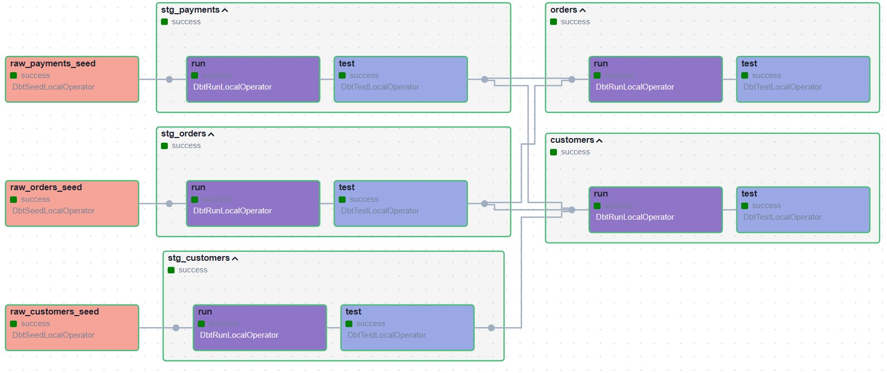

DBT - JAFFLE SHOP
=================

## Stack
- Astro Airflow
- DBT
- Postgres

## Pre-requisites

To get started, you should have The Astro CLI installed. You can find installation instructions [here](https://docs.astronomer.io/astro/cli/install-cli).

## Deploy Your Project Locally

1. Start Airflow on your local machine by running `astro dev start`. This command will spin up 4 Docker containers on your machine, each for a different Airflow component:

    - Postgres: Airflow's Metadata Database
    - Webserver: The Airflow component responsible for rendering the Airflow UI
    - Scheduler: The Airflow component responsible for monitoring and triggering tasks
    - Triggerer: The Airflow component responsible for triggering deferred tasks

2. Verify that all 4 Docker containers were created by running `docker ps`.

    Note: Running 'astro dev start' will start your project with the Airflow Webserver exposed at port 8080 and Postgres exposed at port 5432. If you already have either of those ports allocated, you can either [stop your existing Docker containers or change the port](https://docs.astronomer.io/astro/test-and-troubleshoot-locally#ports-are-not-available).

3. Access the Airflow UI for your local Airflow project. To do so, go to http://localhost:8080/ and log in with 'admin' for both your Username and Password.

    You should also be able to access your Postgres Database at 'localhost:5432/postgres'.

## JAFFLE SHOP DAG

Jaffle Shop is a fictional ecommerce store. This DBT project transforms raw data from an app database into a customers and orders model ready for analytics.

1. Activate the `DBT-Jaffle-Shop` DAG and follow the tasks until completion.
2. After all tasks finished, you can see the result in the the Postgres database.

## Postgres

The final result will be in the Postgres database.

1. Open a terminal
2. List the Dockers containers running `astro dev ps`
3. Enter in the Postgres container running: `docker exec -it <docker-container-name-postgres-1> /bin/bash`
4. Acess the Postgres CLI running: `psql -U postgres`
5. Run `\dt` to see the built tables. Availables tables:
    - `public.raw_customers`
    - `public.raw_orders`
    - `public.raw_payments`
    - `public.customers`
    - `public.orders`

6. Run `\dv` to see the built views. Availables views:
    - `public.stg_customers`
    - `public.stg_orders`
    - `public.stg_payments`

7. Just do select command to see the content of each table/view:  
`select * from public.customers`
